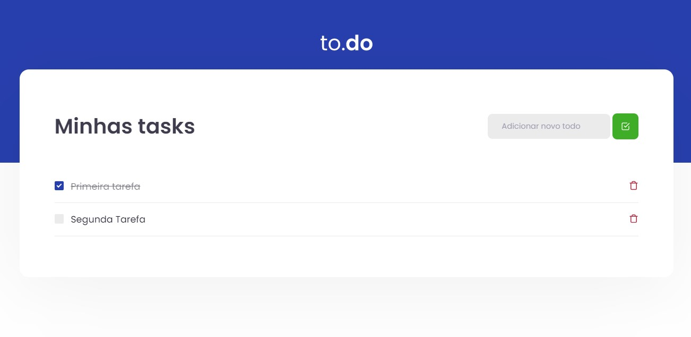
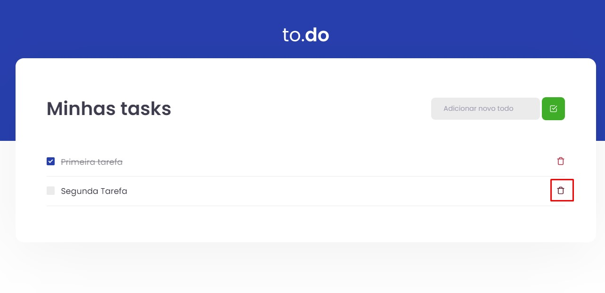
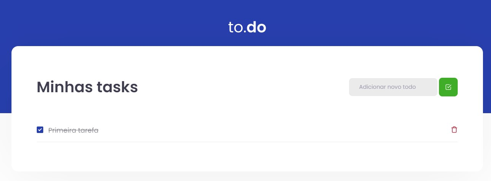

  <h1>:rocket: To-do-list  </h1>
  <h2>1# Desafio Ignite Trilha React</h2>
  
Primeiro desafio proposto na trilha de react do Ignite da Rocketseat, neste desafio foi solicitado que aplicassemos o que aprendemos no primeiro modulo com relação ao hook useState. 

## Atividades propostas
- [x] Adicionar uma nova tarefa
- [x] Remover uma tarefa
- [x] Marcar e desmarcar uma tarefa como concluida

<h3>Solução<h3>
  
Caso queira testar a solução clique <a href="https://to-do-list-guilhermegonzalez.vercel.app">AQUI</a>.

<h3>Adicionar uma nova tarefa</h3>

Para está solução foi verificado se o campo do input continha alguma informação antes de realizar a inserção, após passar por esta verificação é gerado um número aleatório para o ID e o elemento é inserido ao final do array de tarefas 

<h3>Remover uma tarefa</h3>

Nesta está solução basicamente foi aplicado um filter para ignorar o elemento do array que continha o id desejado a ser excluido, sendo assim aplicando o setTasks com o resultado do metodo filter

<h3>Marcar e desmarcar uma tarefa como concluida</h3>

Já nesta solução foi aplicado um if ternário apenas para inverter o valor booleano do isComplete da task, após localiza-la com uma função map

## Giving feedback

Feedback é sempre bem-vindo, se você tiver qualquer sugestão ou duvida por favor me enviar um e-mail: gcgonzalez99@hotmail.com
