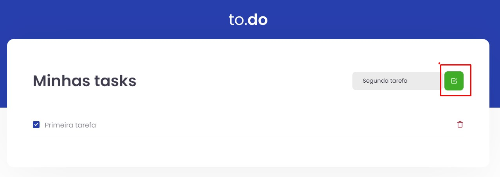

 

  <h1>:rocket: To-do-list  </h1>
  <h2>1# Ignite React Track Challenge</h2>
  
First challenge proposed in the React track of Rocketseat's Ignite. In this challenge, we were asked to apply what we learned in the first module regarding the useState hook.

  
  
If you want to test the solution, click <a href="https://to-do-list-guilhermegonzalez.vercel.app">HERE</a>.

## Proposed Activities
- [x] Add a new task
- [x] Remove a task
- [x] Mark and unmark a task as completed

<h3>Add a new task</h3>

For this solution, it was checked if the input field contained any information before insertion. After this verification, a random number is generated for the ID, and the element is inserted at the end of the tasks array.

<h3>Remove a task</h3>

In this solution, a filter was basically applied to ignore the element of the array containing the desired id to be excluded, thus applying setTasks with the result of the filter method.

<h3>Mark and unmark a task as completed</h3>

In this solution, a ternary if statement was applied just to invert the boolean value of the task's isComplete, after locating it with a map function.

## Giving feedback

Feedback is always welcome, if you have any suggestions or questions please send me an email: gcgonzalez99@hotmail.com

